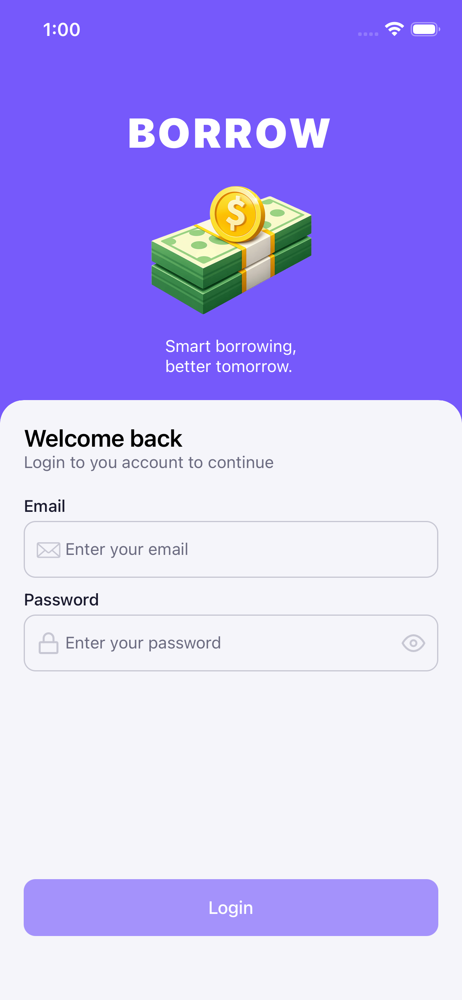
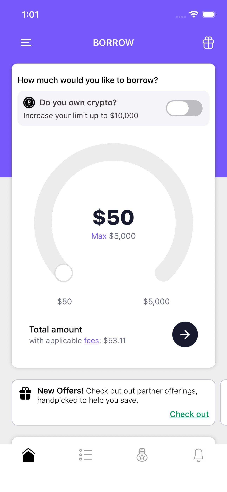

# Borrow

A React Native mobile app for smart borrowing — lets users set a borrow amount via an interactive arc slider, toggle crypto collateral to unlock higher limits, and view loan offers and credit card details.

---

## Demo

### Screen Recording

**[Watch Demo Video](https://drive.google.com/file/d/13ZYv42jBrpw_PG8Yflveboe7D8zltPGq/view?usp=sharing)**

### Screenshots

| Splash                                     | Login                                    | Home                                   |
| ------------------------------------------ | ---------------------------------------- | -------------------------------------- |
|  |  |  |

### APK / Expo Link

APK: [Download](https://drive.google.com/file/d/1c77e_M5x-dsPFzjHDK5cxhghe8DyMx7G/view?usp=sharing)

---

## Setup

### Prerequisites

- Node.js >= 18
- Yarn
- Expo CLI: `npm install -g expo`
- For Android: Android Studio + emulator or physical device
- For iOS: Xcode + simulator (macOS only)

### Install

```bash
git clone https://github.com/aligabalh90100/borrow
cd borrow
yarn install
```

### Run

```bash
# Start dev server (Expo Go)
yarn start

# Android emulator/device
yarn android

# iOS simulator
yarn ios

# Web
yarn web
```

### Test Login Credentials

```
Email:    test@example.com
Password: password123
```

---

## Libraries Used

| Library                            | Purpose                                       |
| ---------------------------------- | --------------------------------------------- |
| `expo` ~54                         | Core Expo SDK                                 |
| `expo-router` ~6                   | File-based navigation                         |
| `@react-navigation/drawer`         | Side drawer navigation                        |
| `@react-navigation/bottom-tabs`    | Bottom tab navigation                         |
| `@tanstack/react-query`            | Server state, mutations, loading/error states |
| `react-hook-form`                  | Form state management                         |
| `yup` + `@hookform/resolvers`      | Form validation schema                        |
| `expo-secure-store`                | Secure token storage (keychain/keystore)      |
| `react-native-mmkv`                | Fast local key-value storage                  |
| `react-native-reanimated`          | Smooth animations (arc slider)                |
| `react-native-gesture-handler`     | Gesture support                               |
| `react-native-keyboard-controller` | Keyboard-aware scroll behavior                |
| `expo-image`                       | Optimized image rendering                     |
| `react-native-svg` + transformer   | SVG icon support                              |
| `react-native-safe-area-context`   | Safe area insets                              |

---

## Architecture

### Folder Structure

```
borrow/
├── app/                        # Expo Router file-based routes
│   ├── _layout.tsx             # Root layout (providers)
│   ├── (splash)/               # Splash screen group
│   ├── (auth)/                 # Auth group (login)
│   └── (drawer)/
│       └── (tabs)/             # Tab screens inside drawer
├── component/
│   ├── buttons/                # BaseButton
│   ├── inputs/                 # EmailInput, PasswordInput, BaseTextInput
│   ├── loading/                # Loading indicator
│   ├── shared/                 # Header, Card, ArcSlider, ErrorMessage, BaseText
│   └── screens/
│       └── home/               # BorrowCard, OffersSlider, CreditCard
├── hooks/
│   └── login/useLogin.ts       # Login logic hook
├── services/
│   ├── auth/                   # Login/logout (mock API)
│   └── secureStorage.ts        # Typed secure storage wrapper
├── constants/
│   └── colors.ts               # App color palette
├── assets/
│   ├── images/                 # App icons, splash
│   ├── screenshots/            # README screenshots
│   └── svg/                    # Custom SVG components
└── validations/
    └── authSchema.ts           # Yup login schema
```

### Navigation Flow

```
Splash (checks token)
  ├── has token  → /homeScreen  (Drawer → Tabs)
  └── no token   → /loginScreen (Auth)

Drawer
  └── Tabs
        ├── Home      (BorrowCard, OffersSlider, CreditCard)
        ├── Notes
        ├── Money
        └── Bills
```

### Key Decisions

**File-based routing (Expo Router)**
Groups `(splash)`, `(auth)`, `(drawer)` are layout groups — they share layouts without adding path segments. Clean separation between auth and app shells.

**TanStack Query for mutations**
Login is a `useMutation` with `onSuccess` handling token storage + navigation. Error state surfaces naturally from the mutation without extra local state.

**Mock auth service**
`services/auth/index.ts` simulates a real API with a 1 s delay and credential check. Swap the function body for a real `fetch`/`axios` call when a backend is ready — the hook and UI stay unchanged.

**expo-secure-store for token**
Token persisted in device keychain (iOS) / keystore (Android). Checked on every cold start in the splash screen to decide routing.

**Custom ArcSlider**
Arc-shaped borrow amount selector built with `react-native-reanimated` and `react-native-gesture-handler`. Max value dynamically changes (5 000 → 10 000) when user toggles crypto collateral ownership.

**Component/hook separation**
Every screen delegates logic to a custom hook (`useLogin`, etc.). Screen files stay presentational only.

---

## Testing

### Stack

| Tool                              | Purpose                        |
| --------------------------------- | ------------------------------ |
| `jest`                            | Test runner                    |
| `@testing-library/react-native`   | Component rendering + querying |
| `@testing-library/user-event`     | User interaction simulation    |
| `react-native-keyboard-controller/jest` | Keyboard controller mock |

### Run Tests

```bash
yarn test
```

### Test Coverage

#### Login Screen (`__tests__/unit/loginScreen.test.tsx`)

| Test | Description |
| ---- | ----------- |
| Render Email, Password, Login Button | Checks all three UI elements mount correctly |
| Login with invalid credentials | Types wrong password → expects `error-message` testID with "Invalid credentials" |
| Login with valid credentials | Types correct creds → expects `router.replace("/homeScreen")` called |

### Setup

`jest.setup.ts` mocks:
- `react-native-keyboard-controller` — uses built-in jest mock
- `expo-router` — stubs `router.push`, `router.replace`, `router.back`

---

## Assumptions

- **Mock backend** — no real API exists; credentials are hardcoded (`test@example.com` / `password123`).
- **Single user session** — no refresh token logic; token is a static string for demo purposes.
- **Crypto toggle** is UI-only — does not call any blockchain or verification service.
- **Offers and credit card data** are static/placeholder — no real loan products wired up.
- Target platforms: **Android + iOS**. Web build works but is not a primary target.
